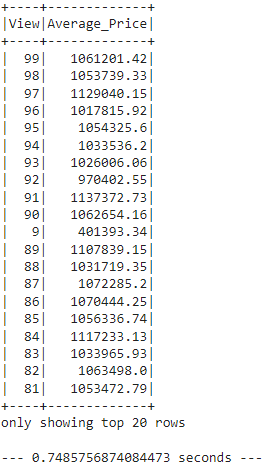

**HOME SALES**

**(1) Project Overview and Purpose:**

The purpose of this exercise is to use SparkSQL to determine key metrics about home sales data, using temporary views, caching, and partitioning to evaluate query processing times.

**(2) Dataset Description:**

The dataset used for this exercise is located here: https://2u-data-curriculum-team.s3.amazonaws.com/dataviz-classroom/v1.2/22-big-data/home_sales_revised.csv. It contains property level information, including identification; date; date built; price; number of bedrooms; number of bathrooms; square footage of living space; square footage of the property lot; number of floors; waterfront view; and number of views.

**(3) Data Cleaning and Preprocessing:**

No cleaning of the data was performed for this exercise. There was no missing data to be removed; no conversions to be undertaken; etc.

**(4) Data Visualization Techniques:**

No bar charts; graphs; or other visualizations were generated for this exercise.

Code resulted in query responses, which were added to the **Output** folder.

**(5) Results and Analysis:**

The following questions were answered during the course of this exercise-

(a) What is the average price for a four-bedroom house sold for each year?

(b) What is the average price of a home for each year the home was built, that has three bedrooms and three bathrooms?

(c) What is the average price of a home for each year the home was built, that has three bedrooms, three bathrooms, two floors, and is greater than or equal to 2,000 square feet?

(d) What is the average price of a home per "view" rating having an average home price greater than or equal to $350,000?

SQL query processing times for the query associated with answering question (d) were measured after caching and partitioning. Per the .ipynb file, the initial query was processed in 0.7485756874084473 seconds. After caching, the query was processed in 1.3996186256408691 seconds. After partitioning, the query originally ran in approximately 1.64 seconds, but running it a second time brought the processing time down to 1.2518165111541748 seconds, which is consistent with retrieving the data from memory rather than reprocessing it from scratch.

**(6) Ethical Considerations:**

There do not appear to be any sensitivities within the dataset. The information may be available via other resources, including online resources. There should not be any germane ethical considerations.

**(7) Instructions for Interacting with the Project:**

Due to issues with Hadoop software on the local machine, the code used for this exercise is configured to run in Colab. It is stored in a file titled "home_sales_starter_code_colab_roop.ipynb" within the main folder.

Query results are filed as .png files in the **Output** folder.

The dataset is available in the main folder as "home_sales_revised.csv". It is also available online at the web address noted in Section 2 above.

**(8) Citations:**

Questions were asked of Xpert Learning Assistant, namely syntax errors and parquet functionality and partitioning.
