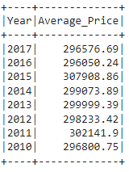
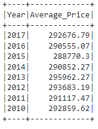
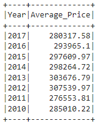

**HOME SALES**

**(1) Project Overview and Purpose:**

The purpose of this exercise is to use SparkSQL to determine key metrics about home sales data, using temporary views, caching, and partitioning to evaluate query processing times.

**(2) Dataset Description:**

The dataset used for this exercise is located here: https://2u-data-curriculum-team.s3.amazonaws.com/dataviz-classroom/v1.2/22-big-data/home_sales_revised.csv. It contains property level information, including identification; date; date built; price; number of bedrooms; number of bathrooms; square footage of living space; square footage of the property lot; number of floors; waterfront view; and number of views.

**(3) Data Cleaning and Preprocessing:**

No cleaning of the data was performed for this exercise. There was no missing data to be removed; no conversions to be undertaken; etc.

**(4) Data Visualization Techniques:**

(Detail the data visualization techniques used in the project, such as bar charts, line graphs, scatter plots, etc. Explain why these techniques were chosen and how they help in understanding the data)

**(5) Results and Analysis:**

The following questions were answered during the course of this exercise-

(a) What is the average price for a four-bedroom house sold for each year? Round off your answer to two decimal places.

(b) What is the average price of a home for each year the home was built, that has three bedrooms and three bathrooms? Round off your answer to two decimal places.

(c) What is the average price of a home for each year the home was built, that has three bedrooms, three bathrooms, two floors, and is greater than or equal to 2,000 square feet? Round off your answer to two decimal places.

(d) What is the average price of a home per "view" rating having an average home price greater than or equal to $350,000? Determine the run time for this query, and round off your answer to two decimal places.

**(6) Ethical Considerations:**

(Discuss any ethical considerations taken into account during the project, such as data privacy, bias, or fairness)

**(7) Instructions for Interacting with the Project:**

(Provide clear instructions on how to interact with the visualizations, such as how to run the code or access the visualizations)

**(8) Citations:**

(Include references to the data sources used, any external libraries or tools utilized, and any other resources that contributed to the project)
